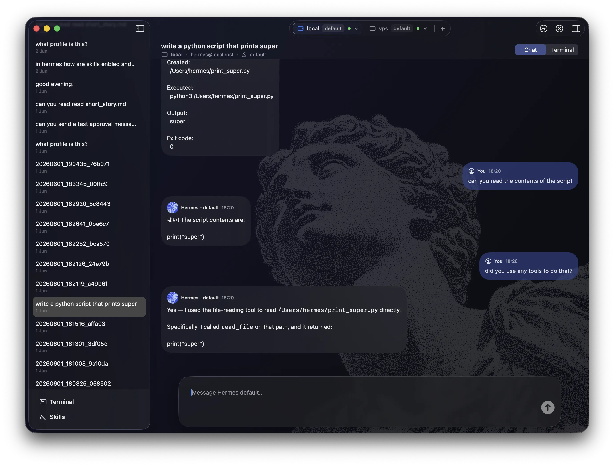
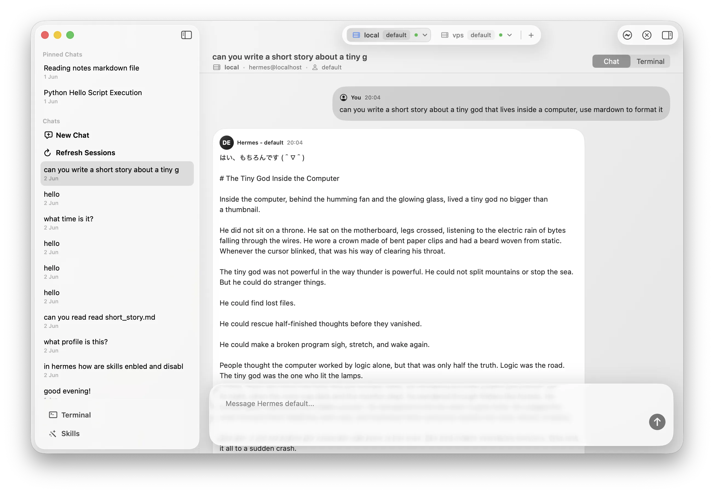
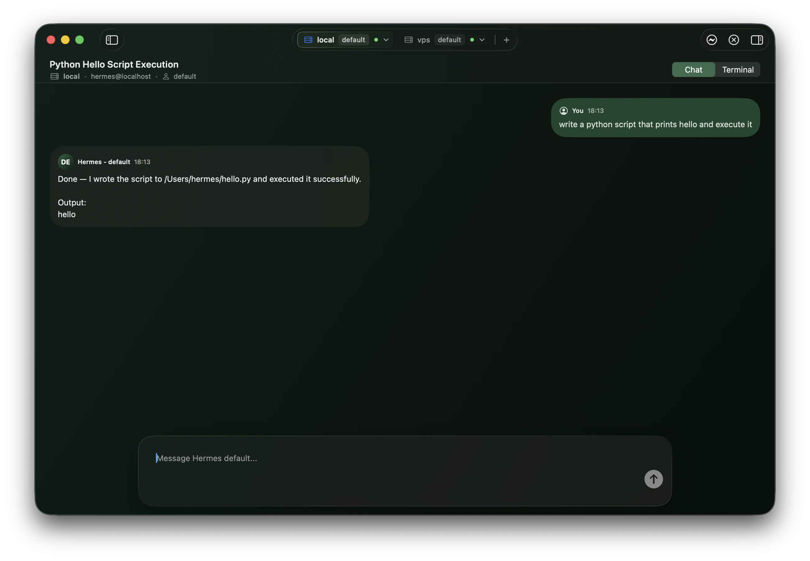
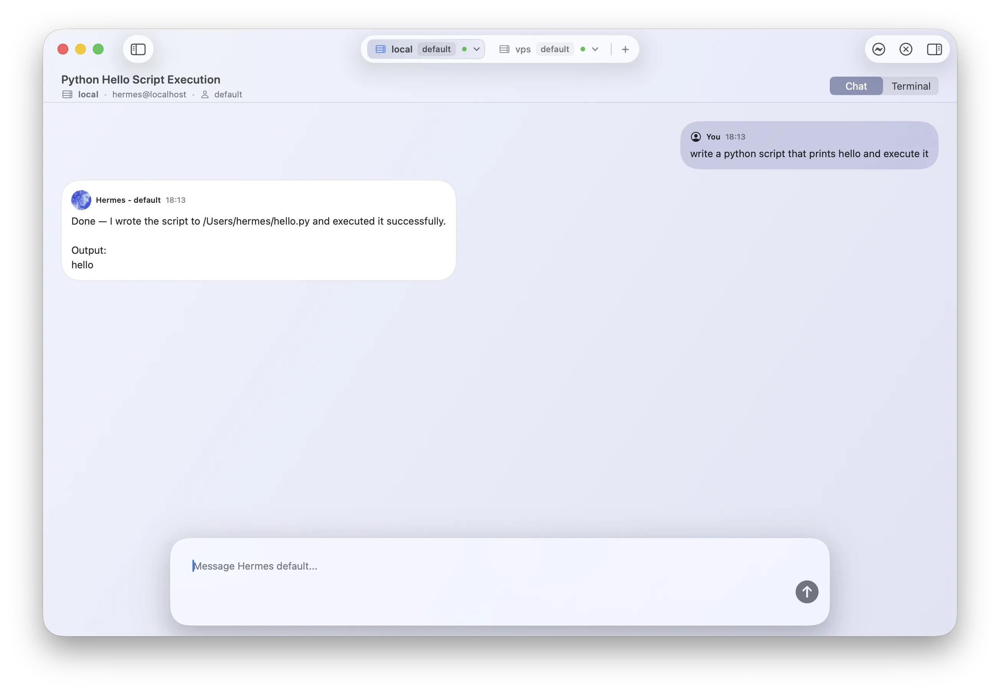

<div align="center">
  
</div>

# HermesMac

HermesMac is a native macOS desktop app for running and managing Hermes agents from a polished SwiftUI interface. It is designed for people who keep Hermes on local or remote machines and want a comfortable Mac app for chat.

This repository is intended for public app distribution. The application source code is not included here. HermesMac is not affiliated with Nous Research or Hermes Agent.

## Screenshots

<table>
  <tr>
    <td></td>
    <td></td>
  </tr>
  <tr>
    <td></td>
    <td></td>
  </tr>
</table>

## Support

If you find HermesMac useful, you can support development on Ko-fi.

[](https://ko-fi.com/06062001)


## Features

### Native macOS Interface

- SwiftUI app experience built for macOS.
- Split-view layout with a persistent chat/session sidebar.
- Connection tabs for switching between Hermes environments.
- Light and dark mode friendly visual styling.
- Profile-aware themes and avatars.
- Some features require the Hermes API to be enabled and running on the target profile.

### SSH Connections

- Connect to any Hermes installation, local or remote via SSH.
- Add, edit, and manage multiple SSH connections.
- Uses the normal macOS/OpenSSH stack for authentication.
- Basically if you can login with `ssh user@host` without a password, this app will work.

### Chat Sessions

- Start new Hermes chats from the Mac app.
- Resume existing Hermes sessions.
- Select Hermes profiles per connection.
- Chat in a clean bubble interface or switch into terminal chat mode for the same session.
- Pin important chats in the sidebar.
- Rename or delete sessions.

### Remote History Sync

- Reads Hermes profile and session history from the selected machine.
- Syncs recent sessions for each selected profile.
- Loads message history from Hermes state databases when available.
- Keeps local app state in Application Support so connections, cached sessions, messages, themes, avatars, approvals, and run state survive restarts.

### Other Features

- Built-in terminal view
- Browse skills for the selected connection and profile.
- See installed, missing, active, and disabled skill states.

### Profile Customization

- Per-profile themes.
- Per-profile avatars.
- Quick profile switching from the connection bar.

## Requirements

- macOS 14 Sonoma or newer.
- A working Hermes CLI installation on each local or remote machine you want to control.
- SSH access for remote hosts.
- OpenSSH configured on macOS for remote connections.
- Optional API access to enable all features.

For remote hosts, configure SSH the same way you normally would in Terminal. For example:

```sshconfig
Host hermes-vps
  HostName example.com
  User ubuntu
  IdentityFile ~/.ssh/id_ed25519
  AddKeysToAgent yes
  UseKeychain yes
```

Then add that host in Hermes Mac using the same user, host, port, and optional key path.

## API

Hermes API is optional, but provides the best experience. An API server and gateway is requires for every profile, and they all need to be running on seperate ports. See here for more information on how to set up Hermes API: https://hermes-agent.nousresearch.com/docs/user-guide/features/api-server#multi-user-setup-with-profiles

Example Hermes profile.env file to enable API:

```apiconfig
API_SERVER_ENABLED=true
API_SERVER_PORT=8643
API_SERVER_KEY=alice-secret
```

## How It Works

Hermes Mac delegates authentication and remote access to OpenSSH. It does not manage private keys itself. For chat and history features, the app talks to the Hermes installation on the selected machine and reads Hermes profile, session, skill, and message metadata when those files are available.

If the API is enabled, the app can take advantage of it to provide a richer experience, for example chat bubbles.

## Distribution

Download the latest Hermes Mac app build from this repository's releases page, then move `HermesMac.app` to your Applications folder.

If macOS Gatekeeper blocks the app on first launch, open System Settings and allow the app from Privacy & Security, or right-click the app and choose Open.

## Privacy and Security

- Private keys remain on your Mac and are handled by OpenSSH.
- SSH credentials are not bundled into the app.
- Hermes Mac stores local app preferences and cached metadata in your macOS user Application Support directory.
- Remote chat, history, profile, and skill data come from the Hermes installation you connect to.

## Troubleshooting

### SSH Connection Fails

- Confirm the same host works in Terminal with `ssh user@host`.
- Check the configured port, username, hostname, and key path.
- If you rely on `~/.ssh/config`, make sure the app connection values match the host you normally use.
- Make sure your key is loaded into ssh-agent or available through Keychain.

### No Profiles or Sessions Appear

- Confirm Hermes is installed on the target machine.
- Confirm the expected profile directories and state files exist under `~/.hermes`.
- Use Refresh Sessions after changing profiles or remote state.

## Status

HermesMac is under active development. Public releases may change as the Hermes CLI and gateway workflows evolve.

